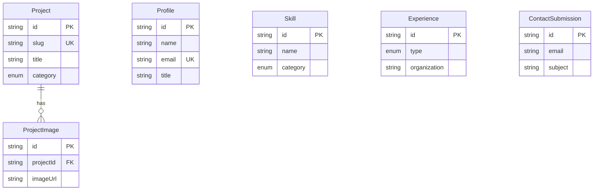

# Database Schema — Prisma + PostgreSQL

> **[AI Agent Instruction]**
> - 본 문서는 `SRS.md` §2의 상세 보충 문서이다.
> - `prisma/schema.prisma` 파일의 전체 정의와 시드 스크립트를 포함한다.
> - 스키마 변경 시 반드시 본 문서를 먼저 갱신하고, 이후 코드에 반영한다.

---

## 1. Prisma Configuration

```prisma
generator client {
  provider = "prisma-client-js"
}

datasource db {
  provider = "postgresql"
  url      = env("DATABASE_URL")
}
```

---

## 2. Models

### 2.1 Profile (개인 정보 — 싱글톤)

```prisma
model Profile {
  id            String   @id @default(cuid())
  name          String
  greeting      String
  title         String
  bio           String[]
  email         String   @unique
  phone         String?
  location      String
  resumeUrl     String
  profileImage  String
  githubUrl     String?
  linkedinUrl   String?
  blogUrl       String?
  twitterUrl    String?
  createdAt     DateTime @default(now())
  updatedAt     DateTime @updatedAt

  @@map("profiles")
}
```

### 2.2 Project (프로젝트)

```prisma
model Project {
  id              String          @id @default(cuid())
  slug            String          @unique
  title           String
  description     String
  longDescription String?         @db.Text
  thumbnail       String
  category        ProjectCategory @default(WEB)
  techStack       String[]
  githubUrl       String?
  liveUrl         String?
  startDate       DateTime
  endDate         DateTime?
  featured        Boolean         @default(false)
  displayOrder    Int             @default(0)
  createdAt       DateTime        @default(now())
  updatedAt       DateTime        @updatedAt

  images          ProjectImage[]

  @@map("projects")
}

enum ProjectCategory {
  WEB
  MOBILE
  DESIGN
  OTHER
}
```

### 2.3 ProjectImage (프로젝트 이미지)

```prisma
model ProjectImage {
  id           String   @id @default(cuid())
  projectId    String
  imageUrl     String
  caption      String?
  displayOrder Int      @default(0)
  createdAt    DateTime @default(now())

  project      Project  @relation(fields: [projectId], references: [id], onDelete: Cascade)

  @@map("project_images")
}
```

### 2.4 Skill (기술 스택)

```prisma
model Skill {
  id           String        @id @default(cuid())
  name         String
  icon         String
  category     SkillCategory
  proficiency  Int?
  displayOrder Int           @default(0)
  createdAt    DateTime      @default(now())

  @@map("skills")
}

enum SkillCategory {
  FRONTEND
  BACKEND
  DEVOPS
  TOOLS
  OTHER
}
```

### 2.5 Experience (경력/학력)

```prisma
model Experience {
  id           String         @id @default(cuid())
  type         ExperienceType
  organization String
  role         String
  startDate    DateTime
  endDate      DateTime?
  description  String[]
  location     String?
  displayOrder Int            @default(0)
  createdAt    DateTime       @default(now())
  updatedAt    DateTime       @updatedAt

  @@map("experiences")
}

enum ExperienceType {
  WORK
  EDUCATION
}
```

### 2.6 ContactSubmission (문의 메시지)

```prisma
model ContactSubmission {
  id        String   @id @default(cuid())
  name      String
  email     String
  subject   String
  message   String   @db.Text
  ipAddress String?
  isRead    Boolean  @default(false)
  createdAt DateTime @default(now())

  @@map("contact_submissions")
}
```

---

## 3. ERD (관계도)



---

## 4. Seed Script

```typescript
// prisma/seed.ts
import { PrismaClient } from '@prisma/client';

const prisma = new PrismaClient();

async function main() {
  await prisma.profile.upsert({
    where: { email: [EMAIL_ADDRESS]' },
    update: {},
    create: {
      name: [AI가 채우는 곳],
      greeting: [AI가 채우는 곳],
      title: [AI가 채우는 곳],
      bio: [AI가 채우는 곳],
      email: [EMAIL_ADDRESS]',
      location: [AI가 채우는 곳],
      resumeUrl: [AI가 채우는 곳],
      profileImage: [AI가 채우는 곳],
      githubUrl: [AI가 채우는 곳],
      linkedinUrl: [AI가 채우는 곳],
    },
  });

  await prisma.skill.createMany({
    data: [
      { name: [AI가 채우는 곳], icon: [AI가 채우는 곳], category: [AI가 채우는 곳], proficiency: [AI가 채우는 곳], displayOrder: [AI가 채우는 곳] },
      { name: [AI가 채우는 곳], icon: [AI가 채우는 곳], category: [AI가 채우는 곳], proficiency: [AI가 채우는 곳], displayOrder: [AI가 채우는 곳] },
      { name: [AI가 채우는 곳], icon: [AI가 채우는 곳], category: [AI가 채우는 곳], proficiency: [AI가 채우는 곳], displayOrder: [AI가 채우는 곳] },
    ],
    skipDuplicates: true,
  });

  await prisma.project.upsert({
    where: { slug: [AI가 채우는 곳] },
    update: {},
    create: {
      slug: [AI가 채우는 곳],
      title: [AI가 채우는 곳],
      description: [AI가 채우는 곳],
      thumbnail: [AI가 채우는 곳],
      category: [AI가 채우는 곳],
      techStack: [AI가 채우는 곳],
      startDate: new Date([AI가 채우는 곳]),
      featured: [AI가 채우는 곳],
      displayOrder: [AI가 채우는 곳],
    },
  });

  console.log('✅ Seed data inserted successfully');
}

main()
  .catch((e) => { console.error(e); process.exit(1); })
  .finally(async () => { await prisma.$disconnect(); });
```

`package.json` 시드 설정:
```json
{
  "prisma": {
    "seed": "ts-node --compiler-options {\"module\":\"CommonModule\"} prisma/seed.ts"
  }
}
```
